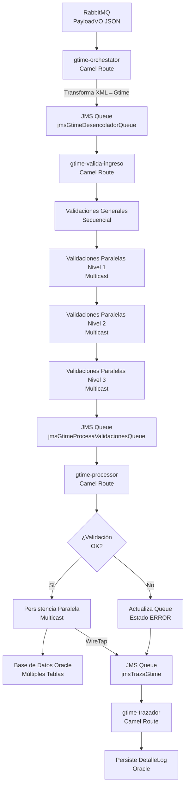
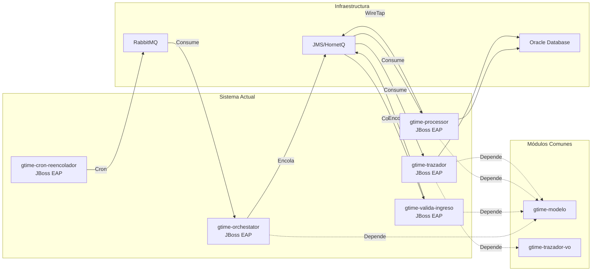
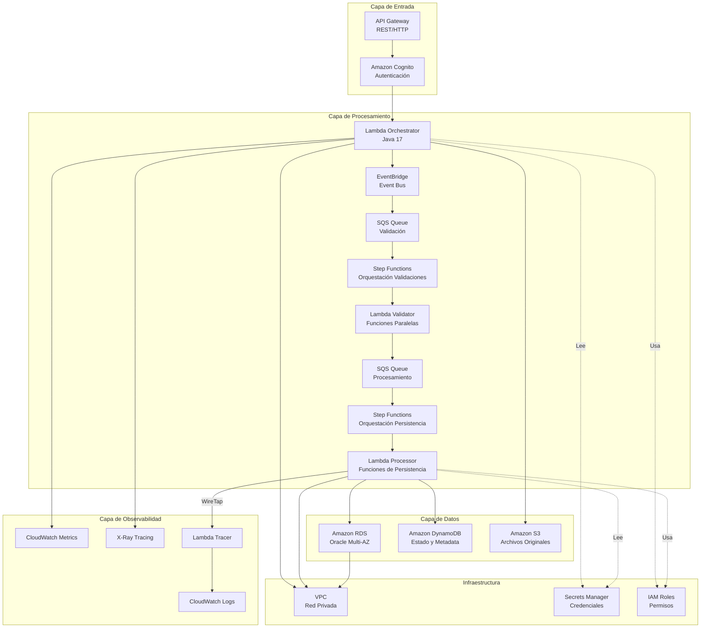
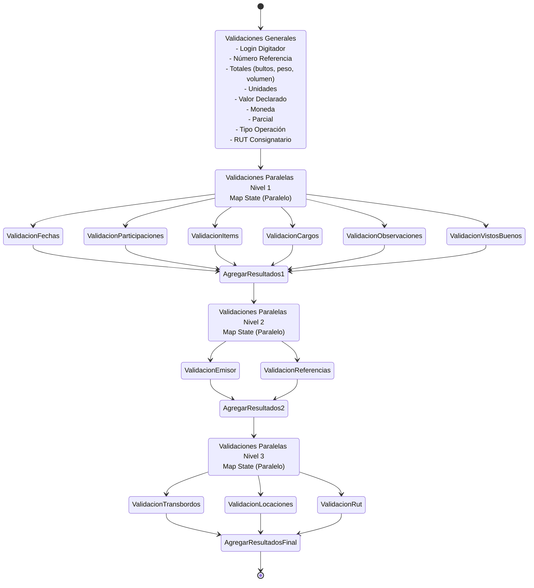
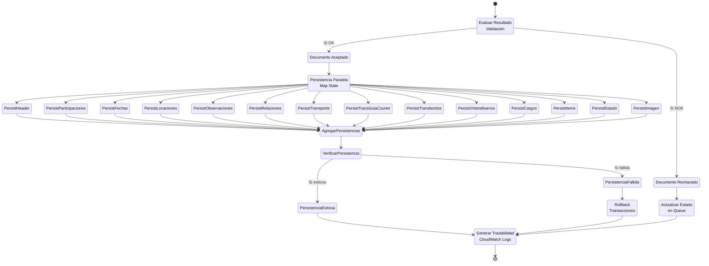
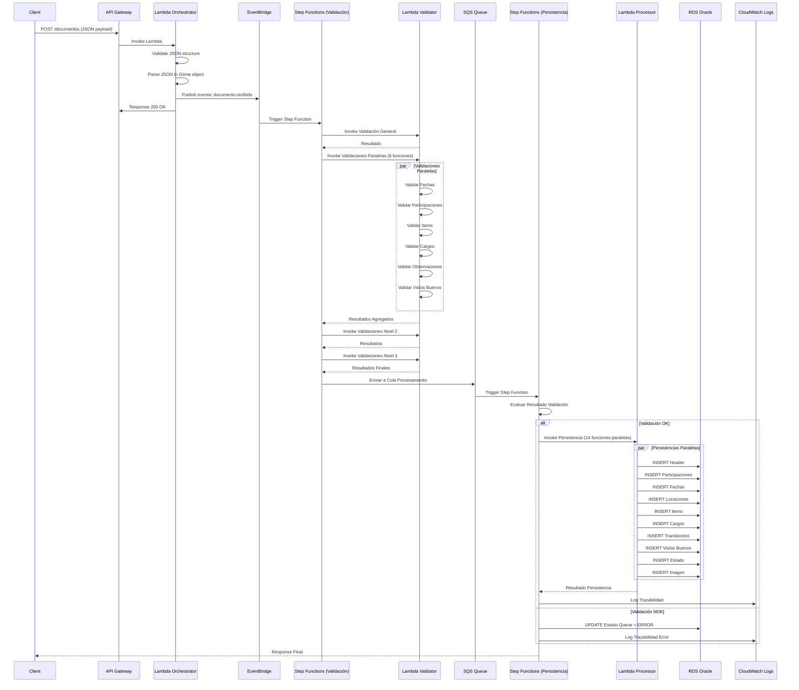
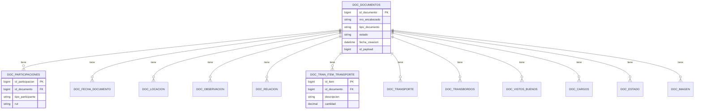

# Diagramas de Arquitectura - Sistema GTIME

## 1. Diagrama de Flujo Actual (JBoss + Camel)



## 2. Arquitectura de Componentes Actual



## 3. Arquitectura Propuesta AWS



## 4. Flujo de Validaciones en Step Functions



## 5. Flujo de Persistencia en Step Functions



## 6. Estructura de Mensajes

### 6.1 Mensaje de Entrada (API Gateway)

**IMPORTANTE:** La nueva aplicación AWS procesa documentos directamente en formato JSON.

```json
{
  "id": "123456789",
  "documento": {
    "nroEncabezado": "GTIME-2024-001",
    "user": "usuario123",
    "tipo": "GUIA_COURIER",
    "version": "1.0",
    "numeroReferencia": "REF-001",
    "totalBultos": "10",
    "totalPeso": "150.5",
    "totalVolumen": "25.3",
    "totalItem": "5",
    "valorDeclarado": "1000.00",
    "monedaValor": "USD",
    "unidadPeso": "KG",
    "unidadVolumen": "M3",
    "parcial": "N",
    "tipoOperacion": "IMPORTACION",
    "fechas": [...],
    "participaciones": [...],
    "locaciones": [...],
    "referencias": [...],
    "items": [...],
    "cargos": [...],
    "observaciones": [...],
    "transbordos": [...],
    "vistosBuenos": [...]
  }
}
```

### 6.2 Objeto Gtime (Después de Parsing JSON)

```json
{
  "idPayload": 123456789,
  "startTime": 1700000000000,
  "nroEncabezado": "GTIME-2024-001",
  "user": "usuario123",
  "tipo": "GUIA_COURIER",
  "version": "1.0",
  "numeroReferencia": "REF-001",
  "totalBultos": "10",
  "totalPeso": "150.5",
  "totalVolumen": "25.3",
  "totalItem": "5",
  "valorDeclarado": "1000.00",
  "monedaValor": "USD",
  "unidadPeso": "KG",
  "unidadVolumen": "M3",
  "parcial": "N",
  "tipoOperacion": "IMPORTACION",
  "fechas": { ... },
  "participaciones": { ... },
  "locaciones": { ... },
  "referencias": { ... },
  "items": { ... },
  "cargos": { ... },
  "observaciones": { ... },
  "transbordos": { ... },
  "vistosBuenos": { ... }
}
```

**Nota:** El documento llega directamente como JSON desde API Gateway, sin necesidad de transformación XML.

### 6.3 DocumentoResponse (Después de Validación)

```json
{
  "nroDocumento": "GTIME-2024-001",
  "listValidaciones": [
    {
      "tipo": "ERROR",
      "texto": "Validación fallida: ...",
      "campo": "totalPeso"
    },
    {
      "tipo": "WARNING",
      "texto": "Advertencia: ...",
      "campo": "observaciones"
    }
  ],
  "gtime": { ... },
  "estadoFinal": "RECHAZADO",
  "listEstadoPersistencia": [ ... ]
}
```

## 7. Secuencia de Procesamiento



## 8. Modelo de Datos Simplificado



## 9. Matriz de Migración

| Componente Actual | Componente AWS Propuesto | Tipo de Migración |
|-------------------|--------------------------|-------------------|
| RabbitMQ Consumer | API Gateway + Lambda Orchestrator | Reescritura |
| Camel Route (Orchestrator) | Lambda Orchestrator | Conversión |
| Camel Route (Validación) | Step Functions + Lambda Validator | Conversión |
| Camel Route (Processor) | Step Functions + Lambda Processor | Conversión |
| Camel Route (Trazador) | Lambda Tracer + CloudWatch | Conversión |
| JMS Queue | SQS Queue | Reemplazo |
| JBoss EAP | Lambda Functions | Reemplazo |
| Oracle Database | RDS Oracle | Migración |
| HornetQ/JMS | SQS / EventBridge | Reemplazo |
| Cron Job (Reencolador) | EventBridge Scheduled Rule | Conversión |

## 10. Comparación de Tecnologías

| Aspecto | Actual (JBoss + Camel) | Propuesto (AWS Serverless) |
|---------|------------------------|----------------------------|
| **Escalabilidad** | Manual (más instancias JBoss) | Automática (Lambda) |
| **Disponibilidad** | Alta (con configuración) | Alta (nativa AWS) |
| **Costos** | Fijos (servidores) | Variables (pay-per-use) |
| **Mantenimiento** | Alto (servidores, JBoss) | Bajo (gestionado) |
| **Despliegue** | Complejo (WAR/EAR) | Simple (Lambda deployment) |
| **Monitoreo** | Logs JBoss | CloudWatch integrado |
| **Cold Start** | No aplica | Sí (mitigable) |
| **Timeout** | Sin límite | 15 min máximo |

---

**Nota:** Estos diagramas son propuestas visuales para facilitar la comprensión de la arquitectura actual y propuesta. Los diagramas Mermaid pueden renderizarse en herramientas como GitHub, GitLab, o editores que soporten Mermaid.

